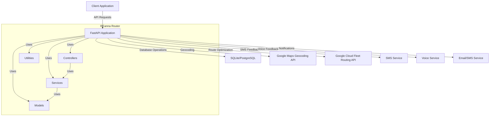
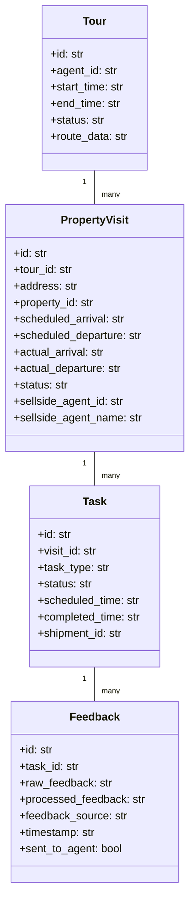
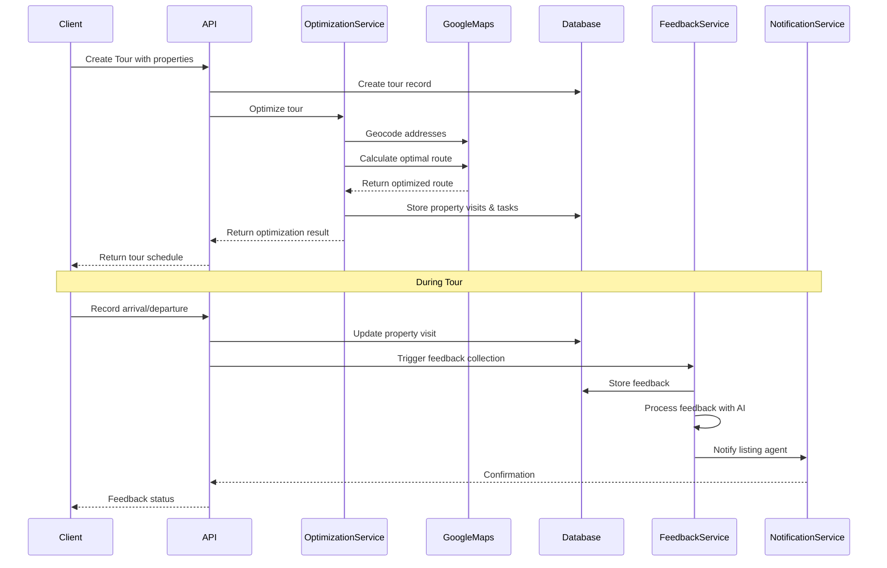

# REanna Router - Architectural & Technical Specification

## 1. System Overview

REanna Router is a FastAPI application designed to optimize real estate tour schedules using Google's Route Optimization API. The system provides comprehensive task management and feedback collection capabilities for real estate agents, enabling them to efficiently schedule property viewings and collect feedback from buyers.

### 1.1 Core Capabilities

- **Tour Optimization**: Utilizes Google's Route Optimization API to create efficient property viewing schedules.
- **Task Management**: Maps shipments to discrete tasks for flexible tour management.
- **Feedback Collection**: Collects and processes buyer feedback in real-time.
- **Agent Notifications**: Notifies listing agents about property feedback.
- **Tour Journal**: Maintains a chronological record of visits and feedback.
- **Optimization Strategies**: Supports different agent preferences (optimize, furthest, closest).

### 1.2 Key Architectural Decisions

- **FastAPI Framework**: Provides async support, automatic OpenAPI documentation, and modern Python typing.
- **Task-Based Architecture**: Maps Google Cloud Fleet Routing "shipments" to discrete tasks in a property tour workflow.
- **SQLite Database**: Lightweight database for development, with a design that can be migrated to more robust DBs for production.
- **Google Cloud Integration**: Leverages Google Maps APIs for geocoding and route optimization.
- **Pydantic Models**: Strong typing and validation for all data models.
- **Asynchronous Processing**: Uses async/await for non-blocking operations, particularly for feedback collection and processing.

### 1.3 Technology Stack

- **Backend**: Python 3.9+, FastAPI
- **Database**: SQLite (development), PostgreSQL/MongoDB (recommended for production)
- **APIs**: Google Maps Geocoding API, Google Cloud Fleet Routing API, Google Route Optimization API
- **Containerization**: Docker
- **Optional Integrations**: SMS and voice services for feedback collection

## 2. System Architecture

### 2.1 Component Diagram

### 2.2 Domain Model

### 2.3 Data Flow

## 3. Component Details

### 3.1 Models

The system uses Pydantic models for validation and SQLite for persistence, with the following key models:

#### 3.1.1 Tour Model

- Represents a complete property viewing schedule for an agent
- Contains details about the agent, start/end times, and status
- Links to multiple property visits
- Stores the optimized route data as JSON

#### 3.1.2 Property Visit Model

- Represents a stop at a specific property
- Contains address, scheduled arrival/departure times, actual arrival/departure times
- Links to a tour and multiple tasks
- Stores details about the property and listing agent

#### 3.1.3 Task Model

- Represents discrete activities associated with property visits
- Types include property tour, feedback collection, agent notification
- Has a status (scheduled, in progress, completed, cancelled, failed)
- Maps to Google's Route Optimization API shipments

#### 3.1.4 Feedback Model

- Stores buyer feedback about properties
- Contains raw feedback and AI-processed feedback
- Tracks whether feedback has been sent to the listing agent
- Identifies the source of the feedback (SMS, voice, app, etc.)

#### 3.1.5 Database Schema

- SQLite for development, designed to be migratable to PostgreSQL
- Uses foreign keys to maintain relational integrity
- Timestamps for created_at and updated_at fields
- Text-based storage for structured data (JSON)

### 3.2 Services

#### 3.2.1 Optimization Service

- Geocodes addresses using Google's Geocoding API
- Calculates visit durations based on property sizes
- Maps property visits to "shipments" for the Route Optimization API
- Calls Google's Route Optimization API to generate optimal routes
- Parses API responses and updates the database

#### 3.2.2 Feedback Service

- Triggers feedback collection after property visits
- Collects feedback via SMS, voice, or other methods
- Processes raw feedback using simplified AI (to be enhanced)
- Notifies listing agents about buyer feedback
- Maintains a chronological tour journal

#### 3.2.3 Notification Service

- Sends notifications to listing agents and buyers
- Supports multiple notification methods (email, SMS, push)
- Handles feedback notifications to listing agents
- Sends tour summaries to agents and buyers
- Processes unsent feedback notifications

### 3.3 API Routes

The API is organized into logical route groups:

#### 3.3.1 Tours Routes

- Creating and retrieving tours
- Updating tour status
- Getting tour journals
- Legacy optimization endpoint for backward compatibility

#### 3.3.2 Property Visits Routes

- Creating and retrieving property visits
- Recording arrival and departure times
- Getting next and current property visits for a tour

#### 3.3.3 Tasks Routes

- Creating tour and feedback tasks
- Updating task status
- Retrieving tasks by various criteria

#### 3.3.4 Feedback Routes

- Submitting feedback via SMS or voice
- Processing feedback with AI
- Notifying listing agents about feedback
- Retrieving feedback by various criteria

### 3.4 Utilities

#### 3.4.1 Time Utilities

- Handling ISO 8601 datetime strings
- Converting between UTC and local times
- Formatting dates and times for display
- Converting between various time units
- Parsing time strings

## 4. Integration Points

### 4.1 Google Cloud Platform

- **Geocoding API**: Convert addresses to lat/lng coordinates
- **Route Optimization API**: Optimize property tour schedules
- **Routes API**: Calculate routes between properties
- **Authentication**: Service account credentials for secure API access

### 4.2 Feedback Collection Services

- The system is designed to integrate with SMS services for text-based feedback
- Voice feedback collection via phone calls (currently simulated)
- Future integrations could include mobile app or web form feedback

### 4.3 Notification Services

- Email notifications to listing agents (currently simulated)
- SMS notifications for real-time updates (currently simulated)
- Push notifications for mobile apps (planned for future)

## 5. Deployment Considerations

### 5.1 Development Environment

- Docker Compose for local development
- SQLite database for simplicity
- Uvicorn development server with auto-reload

### 5.2 Production Environment Recommendations

- **Hosting**: Google Cloud Functions, Google Kubernetes Engine, or Railway
- **Database**: PostgreSQL or MongoDB for improved scalability and reliability
- **Web Server**: Gunicorn with multiple workers for better resource allocation
- **Monitoring**: Implement logging to CloudWatch or similar service
- **Authentication**: Implement proper authentication for API endpoints
- **SSL**: Ensure all endpoints are served over HTTPS

### 5.3 Configuration

- Environment variables for sensitive configuration
- Google Cloud credentials for API access
- Database connection details
- Service integration credentials

## 6. Performance Considerations

### 6.1 Route Optimization

- The Google Route Optimization API has quotas and rate limits
- Optimize API calls by batching requests when possible
- Cache optimization results when routes are unchanged
- Implement fallback strategies for API failures

### 6.2 Database Performance

- For production, consider indexes on frequently queried fields:
  - tour_id in property_visits table
  - visit_id in tasks table
  - task_id in feedback table
- Use connection pooling for database connections
- Consider read replicas for read-heavy workloads

### 6.3 Asynchronous Processing

- The system uses async/await for non-blocking operations
- Further improvements could include:
  - Background job processing for long-running tasks
  - Message queues for reliable task execution
  - Event-driven architecture for better scalability

## 7. Security Considerations

### 7.1 API Security

- Implement proper authentication for all endpoints
- Validate and sanitize all input data
- Rate limiting to prevent abuse
- CORS configuration for production

### 7.2 Data Security

- Encrypt sensitive data at rest
- Use HTTPS for all API communications
- Implement proper access controls for data
- Regular security audits and updates

### 7.3 Google Cloud Security

- Use service accounts with minimal required permissions
- Rotate service account keys regularly
- Store credentials securely (not in code)
- Monitor API usage for anomalies

## 8. Testing Strategy

### 8.1 Unit Testing

- Test individual functions and methods
- Mock external dependencies (Google APIs, database)
- Test edge cases and error handling

### 8.2 Integration Testing

- Test interactions between components
- Verify database operations
- Test API endpoints with realistic data

### 8.3 End-to-End Testing

- Test complete workflows (create tour, optimize, feedback)
- Simulate real user interactions
- Verify system behavior as a whole

## 9. Future Improvements

### 9.1 Enhanced AI Features

- Improved feedback analysis and summarization
- Sentiment analysis for buyer feedback
- Property recommendation based on feedback

### 9.2 Advanced Optimization

- Support for multi-day tours
- Alternative optimization objectives (minimize drive time, maximize properties seen)
- Real-time traffic-based rerouting

### 9.3 Mobile Integration

- Native mobile app for agents
- Real-time GPS tracking during tours
- Push notifications for schedule changes

### 9.4 Expanded Integrations

- Integration with MLS systems for property data
- Calendar integration (Google Calendar, Outlook)
- CRM integration for lead tracking

### 9.5 Analytics and Reporting

- Tour performance metrics
- Feedback trends and insights
- Agent productivity analytics

## 10. Operations Guide

### 10.1 Database Maintenance

- Regular backups
- Database optimization
- Schema migrations for updates

### 10.2 Monitoring

- API response times
- Error rates and logs
- Google API quota usage
- Database performance

### 10.3 Scaling Considerations

- Horizontal scaling for API servers
- Database sharding for large deployments
- Caching strategies for frequently accessed data
- Load balancing for high availability

## 11. Summary

REanna Router is a comprehensive real estate tour management system that leverages Google's Route Optimization API to create efficient property viewing schedules. The system's task-based architecture allows for flexible scheduling, real-time updates, and parallel AI-driven feedback processing. The modular design and use of modern technologies like FastAPI and Pydantic make the system extensible and maintainable.

The primary innovation is the mapping of Google Cloud Fleet Routing "shipments" to discrete tasks in a property tour workflow, allowing for sophisticated optimization while maintaining the flexibility required for real estate tours. The feedback collection and processing capabilities provide additional value by capturing buyer sentiment and automatically notifying listing agents.

Future development should focus on enhancing the AI capabilities, mobile integration, and additional third-party integrations to create a more comprehensive real estate technology platform.
