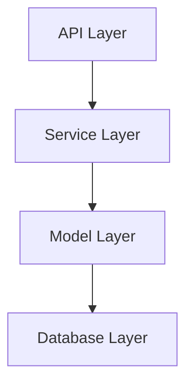
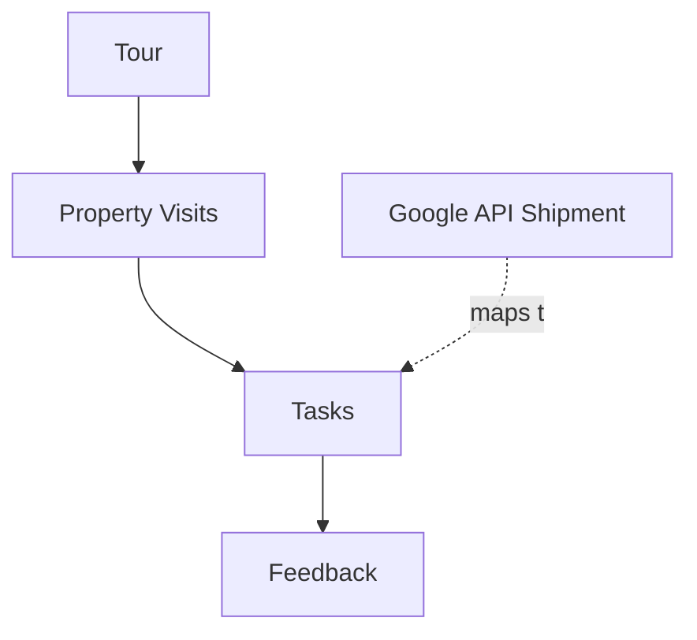
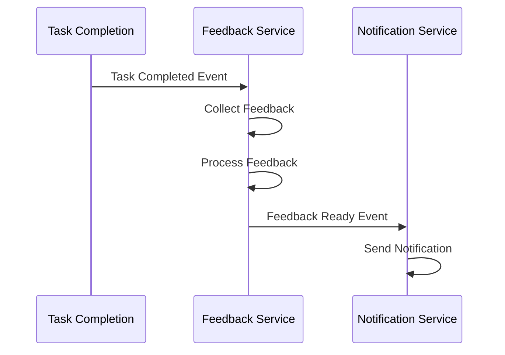
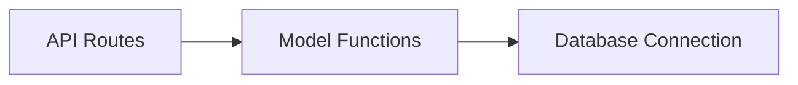
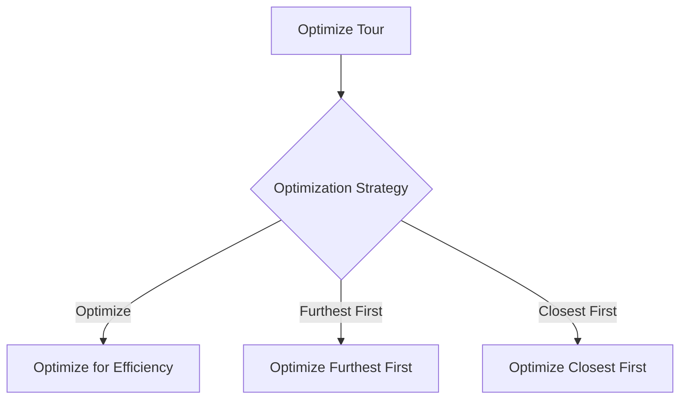
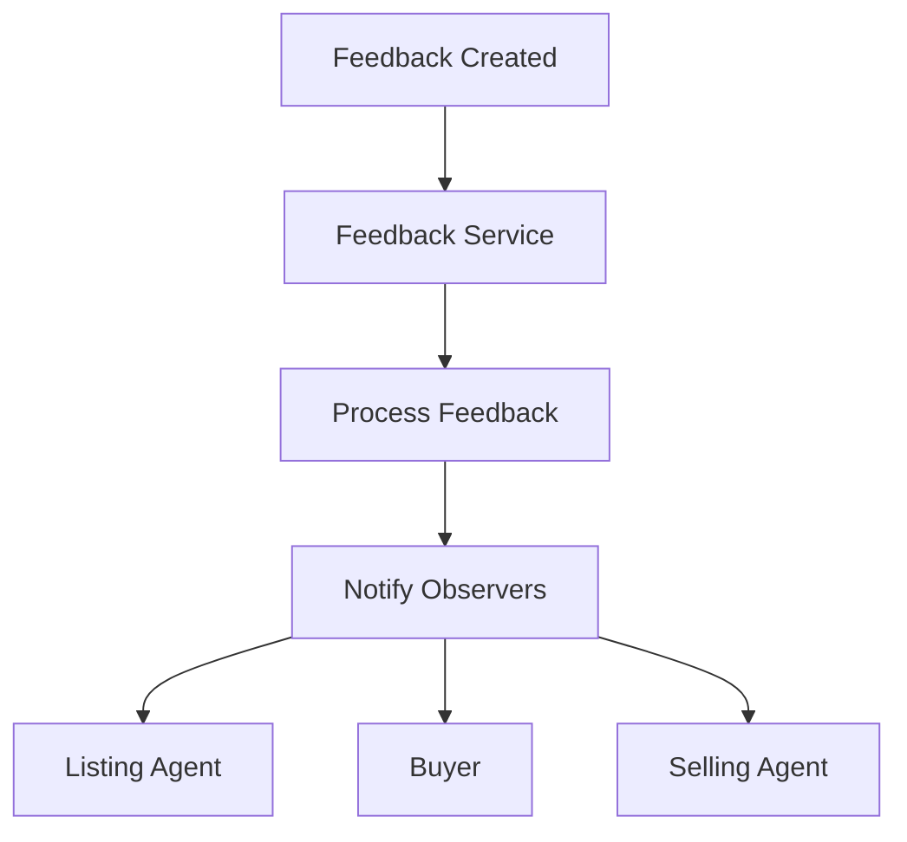
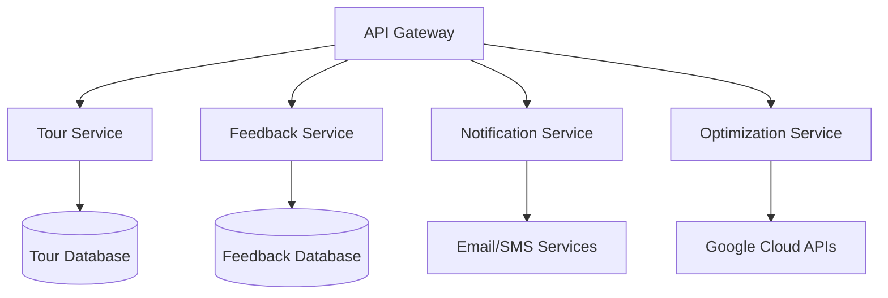
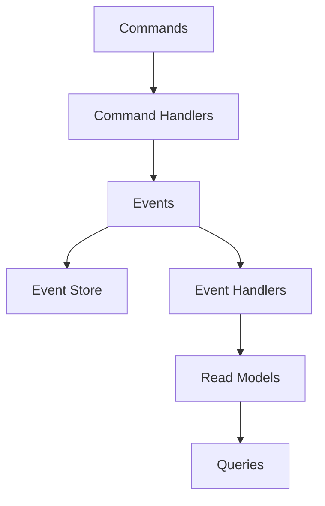
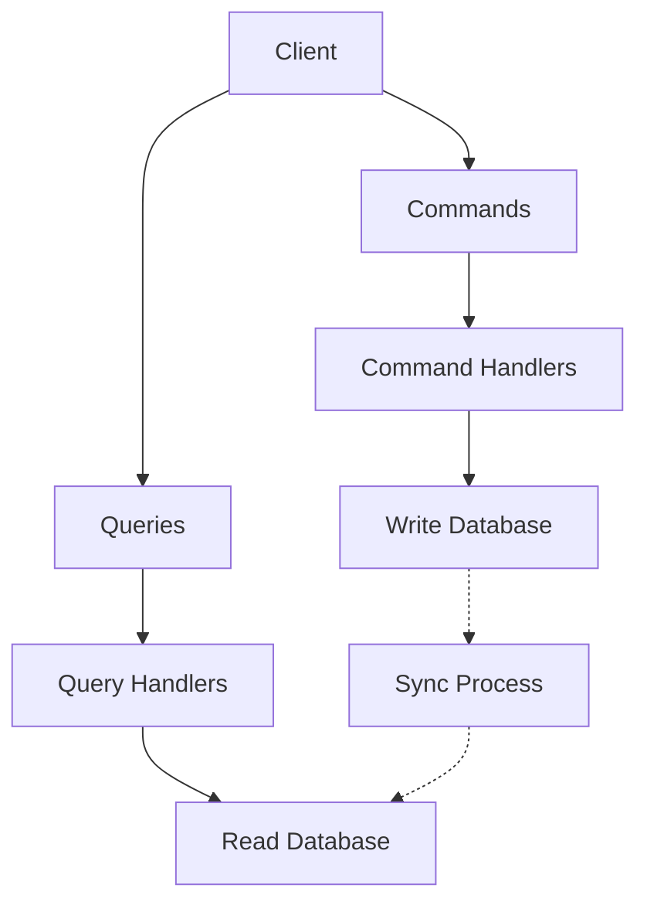
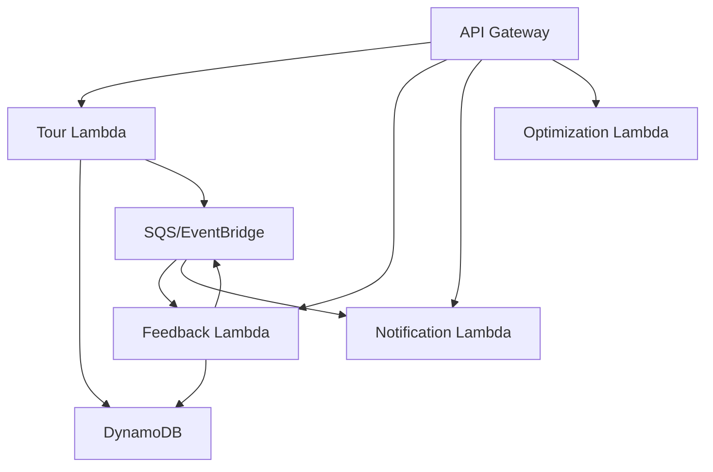

# REanna Router - Design Patterns & Architectural Considerations

This document outlines the architectural patterns, design considerations, and best practices used in the REanna Router system. It serves as a guide to understanding the system's architecture and provides recommendations for maintaining and extending the system.

## 1. Architectural Patterns

### 1.1 Layered Architecture

REanna Router uses a classic layered architecture pattern to separate concerns and ensure modularity:



- **API Layer**: FastAPI routes and controllers that handle HTTP requests
- **Service Layer**: Business logic that orchestrates operations
- **Model Layer**: Data models and validation using Pydantic
- **Database Layer**: Data access and storage using SQLite

Benefits of this approach:

- Clear separation of concerns
- Easier testing of individual layers
- Improved maintainability and extensibility
- Ability to change implementations within a layer with minimal impact on other layers

### 1.2 Task-Based Architecture

A key innovation in REanna Router is its task-based architecture, which maps Google Cloud Fleet Routing "shipments" to discrete tasks in the system:



This pattern:

- Breaks complex workflows into discrete, manageable tasks
- Allows for parallel processing of tasks
- Facilitates tracking of task status and progress
- Enables flexible scheduling and rescheduling

### 1.3 Event-Driven Architecture

For certain operations, particularly feedback collection and processing, the system employs an event-driven approach:



This pattern:

- Reduces coupling between components
- Enables asynchronous processing
- Allows for easy addition of new event handlers
- Provides natural extension points for the system

### 1.4 Repository Pattern

For database operations, the system uses a simplified repository pattern:



Each model has its own set of functions for CRUD operations, which encapsulate SQL queries and database interactions. This pattern:

- Centralizes data access logic
- Abstracts database operations
- Provides a consistent interface for data access
- Makes it easier to change the database implementation

## 2. Design Patterns

### 2.1 Factory Pattern

The system uses factory functions to create new instances of models:

```python
def create_tour(tour: TourCreate) -> Tour:
    """Create a new tour in the database."""
    tour_id = generate_id()
    now = current_timestamp()
    
    # Database operations...
    
    return Tour(
        id=tour_id,
        agent_id=tour.agent_id,
        # Other fields...
    )
```

This pattern:

- Encapsulates object creation logic
- Ensures proper initialization of objects
- Centralizes ID generation and timestamp creation
- Makes it easier to modify creation logic in the future

### 2.2 Strategy Pattern

For route optimization, the system employs a simplified strategy pattern:



This allows for different optimization approaches based on agent preferences, which could be extended in the future.

### 2.3 Command Pattern

Task execution follows a command pattern, where each task represents a command to be executed:

```python
class TaskType(str, Enum):
    PROPERTY_TOUR = "property_tour"
    FEEDBACK_COLLECTION = "feedback_collection"
    LISTING_AGENT_NOTIFICATION = "listing_agent_notification"
    BUYER_FOLLOWUP = "buyer_followup"
```

Each task type has its own handler in the service layer, which knows how to execute that specific type of task.

### 2.4 Observer Pattern

The feedback notification system implements a simplified observer pattern:



When feedback is collected and processed, the system notifies interested parties based on their preferences.

### 2.5 Context Manager Pattern

For database connections, the system uses a context manager pattern:

```python
@contextmanager
def get_db_connection():
    """Context manager for database connections."""
    conn = sqlite3.connect(DB_PATH)
    conn.row_factory = dict_factory
    conn.execute("PRAGMA foreign_keys = ON")
    try:
        yield conn
    finally:
        conn.close()
```

This ensures proper resource management and exception handling for database connections.

## 3. Implementation Patterns

### 3.1 Dependency Injection

While not using a formal dependency injection framework, the system employs manual dependency injection through function parameters:

```python
@router.get("/{tour_id}/journal", response_model=Dict[str, Any])
async def get_tour_journal_entries(tour_id: str):
    """
    Get the journal entries for a tour.
    """
    tour = get_tour(tour_id)
    # ...
    
    # Get the tour journal
    from app.services import get_tour_journal
    journal = await get_tour_journal(tour_id)
    
    return {
        "tour_id": tour_id,
        "journal_entries": journal
    }
```

This approach:

- Makes dependencies explicit
- Facilitates testing through mocking
- Keeps functions loosely coupled
- Provides clarity about required dependencies

### 3.2 Data Transfer Objects (DTOs)

The system uses Pydantic models as DTOs to validate and transform data between layers:

```python
class TourBase(BaseModel):
    agent_id: str
    start_time: str
    end_time: str
    status: str = "scheduled"

class TourCreate(TourBase):
    pass

class Tour(TourBase):
    id: str
    route_data: Optional[str] = None
    created_at: str
    updated_at: str
```

This pattern:

- Ensures data validation at boundaries
- Provides clear contracts between layers
- Enables automatic documentation of data structures
- Supports serialization and deserialization

### 3.3 Asynchronous Processing

For operations that can be performed in parallel or need to be non-blocking, the system uses async/await:

```python
async def trigger_feedback_collection(task_id: str) -> Dict[str, Any]:
    # ...
    
    # Initiate feedback collection methods in parallel
    collection_tasks = []
    for method in feedback_methods:
        if method == "sms":
            collection_tasks.append(collect_sms_feedback(feedback_task.id, property_visit.id))
        elif method == "voice":
            collection_tasks.append(collect_voice_feedback(feedback_task.id, property_visit.id))
    
    # Run feedback collection methods in parallel
    await asyncio.gather(*collection_tasks)
    
    return {
        "status": "feedback_collection_initiated",
        "feedback_task_id": feedback_task.id
    }
```

This approach:

- Improves performance for I/O-bound operations
- Allows for parallel execution of independent tasks
- Provides better resource utilization
- Enables handling of concurrent requests efficiently

### 3.4 Service Layer Pattern

Business logic is encapsulated in service modules, which coordinate operations across models:

```python
def optimize_tour(
    tour: Tour,
    properties: List[Dict[str, Any]],
    agent_home: str
) -> Dict[str, Any]:
    # Geocode agent home
    agent_coords = geocode_address(agent_home)
    
    # Map properties to shipments
    request_body, shipment_to_visit_map = map_properties_to_shipments(tour, properties, agent_coords)
    
    # Call the optimization API
    api_response = call_route_optimization_api(request_body)
    
    # Parse the response
    result = parse_optimization_response(api_response, shipment_to_visit_map)
    
    return result
```

This pattern:

- Centralizes business logic
- Coordinates operations across multiple models
- Keeps API routes lean and focused on request handling
- Facilitates reuse of business logic across different API endpoints

## 4. Error Handling Patterns

### 4.1 Exception-Based Error Handling

The system uses exceptions to handle errors and provides consistent error responses:

```python
@router.post("/", response_model=Dict[str, Any])
async def create_new_tour(...):
    try:
        # Business logic...
    except Exception as e:
        logging.error(f"Error optimizing tour: {e}")
        # If optimization fails, still return the tour ID
        return {
            "tour_id": created_tour.id,
            "error": str(e)
        }
```

### 4.2 Graceful Degradation

For operations that depend on external services, the system implements graceful degradation:

```python
def call_route_optimization_api(body: Dict[str, Any]) -> Dict[str, Any]:
    try:
        # Call the API...
    except Exception as e:
        logging.error(f"Route Optimization API error: {e}")
        # Return a fallback response that allows the system to continue
        return {"routes": []}
```

### 4.3 Logging for Troubleshooting

The system uses extensive logging to aid in troubleshooting:

```python
logging.info(f"Collecting SMS feedback for task {task_id}, visit {visit_id}")
# ...
logging.info(f"Notifying listing agent {property_visit.sellside_agent_name} about feedback for {property_visit.address}")
```

## 5. Testing Patterns

### 5.1 Unit Testing with Mocks

For unit testing, the system mocks external dependencies:

```python
def test_optimize_tour():
    # Arrange
    tour = Mock(spec=Tour)
    properties = [...]
    agent_home = "123 Main St"
    
    # Mock external dependencies
    geocode_address_mock = Mock(return_value={"lat": 1.0, "lng": 1.0})
    call_api_mock = Mock(return_value={"routes": [...]})
    
    with patch("app.services.optimization_service.geocode_address", geocode_address_mock):
        with patch("app.services.optimization_service.call_route_optimization_api", call_api_mock):
            # Act
            result = optimize_tour(tour, properties, agent_home)
            
            # Assert
            assert "schedule" in result
            assert len(result["schedule"]) == len(properties)
```

### 5.2 Integration Testing

For integration testing, the system tests the interaction between components:

```python
def test_create_tour_endpoint():
    # Arrange
    client = TestClient(app)
    
    # Act
    response = client.post(
        "/tours/",
        params={...},
        json=[...]
    )
    
    # Assert
    assert response.status_code == 200
    assert "tour_id" in response.json()
```

### 5.3 End-to-End Testing

For end-to-end testing, the system tests complete workflows:

```python
def test_complete_tour_workflow():
    # Arrange
    client = TestClient(app)
    
    # Act - Create tour
    response = client.post("/tours/", ...)
    tour_id = response.json()["tour_id"]
    
    # Act - Get property visits
    response = client.get(f"/property-visits/?tour_id={tour_id}")
    visit_id = response.json()[0]["visit_id"]
    
    # Act - Record arrival
    client.put(f"/property-visits/{visit_id}/arrival")
    
    # Act - Record departure
    client.put(f"/property-visits/{visit_id}/departure")
    
    # Act - Get feedback
    response = client.get(f"/feedback/?visit_id={visit_id}")
    
    # Assert
    assert len(response.json()) > 0
```

## 6. Extending the System

### 6.1 Adding New Task Types

To add a new task type, follow these steps:

1. Add the new task type to the TaskType enum:

   ```python
   class TaskType(str, Enum):
       PROPERTY_TOUR = "property_tour"
       FEEDBACK_COLLECTION = "feedback_collection"
       NEW_TASK_TYPE = "new_task_type"
   ```

2. Create a factory function for the new task type:

   ```python
   def create_new_task_type_task(visit_id: str, scheduled_time: str) -> Task:
       task = TaskCreate(
           visit_id=visit_id,
           task_type="new_task_type",
           status="scheduled",
           scheduled_time=scheduled_time
       )
       return create_task(task)
   ```

3. Implement a handler for the new task type in the appropriate service:

   ```python
   async def handle_new_task_type(task_id: str) -> Dict[str, Any]:
       task = get_task(task_id)
       if not task:
           return {"error": "Task not found"}
       
       # Task-specific logic...
       
       return {"status": "task_handled", "task_id": task_id}
   ```

4. Add an API endpoint for the new task type:

   ```python
   @router.post("/new-task-type", response_model=Dict[str, Any])
   async def create_new_task_type_endpoint(visit_id: str, scheduled_time: str):
       task = create_new_task_type_task(visit_id, scheduled_time)
       return {"task_id": task.id, "status": task.status}
   ```

### 6.2 Implementing New Optimization Strategies

To add a new optimization strategy:

1. Create a new function in the optimization service:

   ```python
   def optimize_tour_custom_strategy(
       tour: Tour,
       properties: List[Dict[str, Any]],
       agent_home: str
   ) -> Dict[str, Any]:
       # Custom optimization logic...
       return result
   ```

2. Modify the optimize_tour function to accept a strategy parameter:

   ```python
   def optimize_tour(
       tour: Tour,
       properties: List[Dict[str, Any]],
       agent_home: str,
       strategy: str = "default"
   ) -> Dict[str, Any]:
       if strategy == "custom":
           return optimize_tour_custom_strategy(tour, properties, agent_home)
       else:
           # Default optimization logic...
           return result
   ```

3. Update the API endpoint to accept the strategy parameter:

   ```python
   @router.post("/", response_model=Dict[str, Any])
   async def create_new_tour(
       agent_id: str,
       start_time: str,
       end_time: str,
       agent_home: str,
       properties: List[Dict[str, Any]],
       strategy: str = "default"
   ):
       # Create tour...
       optimization_result = optimize_tour(created_tour, properties, agent_home, strategy)
       # Return result...
   ```

### 6.3 Adding New Feedback Processing Approaches

To implement a new feedback processing approach:

1. Create a new function in the feedback service:

   ```python
   async def process_feedback_with_new_approach(raw_feedback: str) -> str:
       # New processing logic...
       return processed_feedback
   ```

2. Modify the process_feedback function to accept an approach parameter:

   ```python
   async def process_feedback(
       feedback_id: str,
       approach: str = "default"
   ) -> Dict[str, Any]:
       feedback = get_feedback(feedback_id)
       if not feedback:
           return {"error": "Feedback not found"}
       
       raw_feedback = feedback.raw_feedback or ""
       
       if approach == "new":
           processed_feedback = await process_feedback_with_new_approach(raw_feedback)
       else:
           processed_feedback = await summarize_feedback_with_ai(raw_feedback)
       
       add_processed_feedback(feedback_id, processed_feedback)
       await notify_listing_agent(feedback_id)
       
       return {"status": "feedback_processed", "feedback_id": feedback_id}
   ```

3. Update the API endpoint to accept the approach parameter:

   ```python
   @router.put("/{feedback_id}/process", response_model=Dict[str, Any])
   async def process_feedback_endpoint(feedback_id: str, approach: str = "default"):
       result = await process_feedback(feedback_id, approach)
       return result
   ```

## 7. Future Architectural Considerations

### 7.1 Microservices Architecture

As the system grows, consider splitting it into microservices:



This would provide:

- Better scalability for individual components
- Independent deployment of services
- Technology diversity where appropriate
- Isolation of failures

### 7.2 Event Sourcing

For more complex requirements around audit trails and system state, consider implementing event sourcing:



This would provide:

- Complete audit history of all state changes
- Ability to reconstruct the system state at any point in time
- Better support for debugging and troubleshooting
- Improved scalability for read operations

### 7.3 CQRS (Command Query Responsibility Segregation)

For systems with complex querying requirements, consider implementing CQRS:



This would provide:

- Optimized data models for reads and writes
- Better performance for complex queries
- Simplified command processing
- Improved scalability

### 7.4 Serverless Architecture

For cost optimization and automatic scaling, consider serverless architecture:



This would provide:

- Automatic scaling based on demand
- Pay-per-use cost model
- Zero server maintenance
- Built-in high availability

## 8. Recommendations

### 8.1 Short-Term Recommendations

1. **Improve Error Handling**: Implement more robust error handling and recovery mechanisms, particularly for integrations with external services.
2. **Add Comprehensive Logging**: Enhance logging to provide better visibility into system operations and troubleshooting.
3. **Implement Authentication**: Add proper authentication and authorization for API endpoints.
4. **Enhance Feedback Processing**: Improve the AI-based feedback processing with more sophisticated NLP techniques.
5. **Add Caching**: Implement caching for frequently accessed data and API calls to improve performance.

### 8.2 Medium-Term Recommendations

1. **Develop API Versioning**: Implement proper API versioning to support backward compatibility.
2. **Expand Test Coverage**: Create a comprehensive test suite covering unit, integration, and end-to-end tests.
3. **Implement Real Service Integrations**: Replace simulated SMS and voice service integrations with real implementations.
4. **Add Performance Monitoring**: Implement monitoring and alerting for system performance and errors.
5. **Optimize Database Access**: Improve database access patterns with indexes and query optimization.

### 8.3 Long-Term Recommendations

1. **Consider Microservices**: Evaluate the benefits of migrating to a microservices architecture.
2. **Implement Event Sourcing**: Consider implementing event sourcing for improved auditing and system state management.
3. **Explore Serverless Options**: Evaluate serverless architectures for cost optimization and scalability.
4. **Develop Mobile Integration**: Create native mobile apps for agents and buyers.
5. **Build Advanced Analytics**: Implement data analytics for tour performance, feedback trends, and agent productivity.

## 9. Conclusion

REanna Router employs a thoughtful combination of architectural and design patterns to create a maintainable, extensible system for real estate tour optimization. The task-based architecture, combined with service-oriented design and asynchronous processing, provides a solid foundation for the current functionality while allowing for future growth and enhancements.

By following the patterns and principles outlined in this document, developers can maintain consistency and quality as they extend and enhance the system. The recommendations provided here should serve as a roadmap for improving the system's robustness, performance, and scalability over time.
