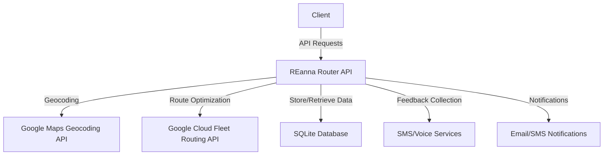
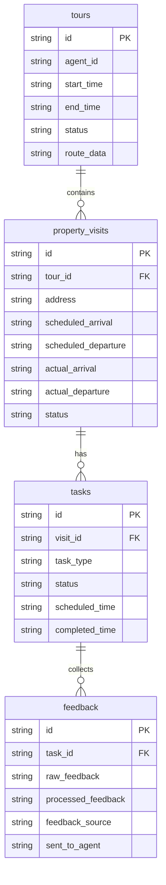

# REanna Router - Executive Summary

## System Overview

REanna Router is a FastAPI application designed to optimize real estate tour schedules using Google's Route Optimization API. The system provides comprehensive task management and feedback collection capabilities, enabling real estate agents to efficiently schedule property viewings and collect/process buyer feedback in real-time.

### Key Capabilities

- **Tour Optimization**: Creates efficient property viewing schedules
- **Task Management**: Maps API "shipments" to discrete tour workflow tasks
- **Feedback Collection**: Collects and processes buyer feedback in real-time
- **Agent Notifications**: Notifies listing agents about property feedback
- **Tour Journal**: Maintains a chronological record of visits and feedback

## Core Architecture

REanna Router employs a layered architecture with a task-based workflow model:

1. **API Layer** (FastAPI Routes): Handles HTTP requests and responses
2. **Service Layer**: Contains business logic and integrations
3. **Model Layer**: Defines data structures and database operations
4. **Database Layer**: Provides data persistence using SQLite

The **task-based architecture** is a key innovation, mapping Google Cloud Fleet Routing "shipments" to discrete tasks in a property tour workflow:

- **Tours**: Represent a complete property viewing schedule
- **Property Visits**: Individual stops at properties within a tour
- **Tasks**: Discrete activities associated with property visits (touring, feedback collection)
- **Feedback**: Buyer feedback collected via various methods

## Key Components Overview

### Models

| Model | Purpose | Key Functions |
|-------|---------|--------------|
| Tour | Represents a complete tour schedule | create_tour, get_tour, update_tour |
| PropertyVisit | Represents a stop at a property | create_property_visit, record_arrival, record_departure |
| Task | Represents discrete activities | create_task, update_task_status, get_tasks_by_visit |
| Feedback | Stores buyer feedback | create_feedback, process_feedback, mark_feedback_as_sent |

### Services

| Service | Purpose | Key Features |
|---------|---------|-------------|
| Optimization Service | Optimizes tour routes | Geocoding, route optimization, visit duration calculation |
| Feedback Service | Collects and processes feedback | SMS/voice feedback collection, AI-based processing |
| Notification Service | Sends notifications | Agent notifications, tour summaries, feedback alerts |

### API Routes

- **/tours/**: Create and manage tours
- **/property-visits/**: Manage property visits, record arrivals/departures
- **/tasks/**: Create and manage tasks of different types
- **/feedback/**: Submit and process feedback

## Technical Implementation Highlights

### Database Schema

### Core Workflows

1. **Tour Creation & Optimization**:
   - Agent provides list of properties and preferences
   - System geocodes addresses
   - Google Route Optimization API calculates optimal route
   - System creates property visits and tasks
   - Optimized schedule is returned to agent

2. **Tour Execution**:
   - Agent records arrival/departure at each property
   - Tasks are automatically updated (scheduled → in_progress → completed)
   - Feedback collection is triggered after completed visits
   - Listing agents are notified about feedback

3. **Feedback Processing**:
   - System collects feedback via SMS/voice
   - AI processing extracts key points and sentiment
   - Processed feedback is sent to listing agents
   - Feedback is stored in the tour journal

## Design Patterns & Architectural Considerations

### Key Design Patterns

1. **Repository Pattern**: For database operations
2. **Factory Pattern**: For creating model instances
3. **Strategy Pattern**: For route optimization approaches
4. **Command Pattern**: For task execution
5. **Observer Pattern**: For feedback notifications

### Implementation Patterns

1. **Asynchronous Processing**: For parallel operations
2. **Context Managers**: For resource management
3. **DTOs (Pydantic Models)**: For data validation
4. **Service Layer**: For business logic encapsulation

## Recommendations for Future Development

### Short-Term Improvements

1. **Authentication & Authorization**: Implement proper security for API endpoints
2. **Comprehensive Testing**: Add unit, integration, and end-to-end tests
3. **Improved Error Handling**: Enhance error handling and logging
4. **Enhanced AI Processing**: Improve feedback analysis capabilities

### Mid-Term Improvements

1. **Real Service Integrations**: Implement actual SMS/voice service integrations
2. **Mobile App Integration**: Develop mobile interfaces for agents
3. **Advanced Analytics**: Implement reporting on tour and feedback data
4. **Performance Optimization**: Add caching and database optimizations

### Long-Term Architecture Evolution

1. **Microservices Architecture**: Split into specialized services
2. **Event Sourcing**: For improved audit trails and state reconstruction
3. **CQRS**: For optimized read/write operations
4. **Serverless Architecture**: For automatic scaling and cost optimization

## Documentation Guide

The following documents provide detailed information about different aspects of the system:

1. **[Architecture Specification](architecture-spec.md)**: Comprehensive overview of the system architecture, components, and deployment considerations.

2. **[Technical Implementation](technical-implementation.md)**: Detailed implementation notes, code structure, and key implementation patterns.

3. **[Developer Guide](developer-guide.md)**: Practical information for developers working with the system, including setup, API usage examples, and troubleshooting.

4. **[Design Patterns](design-patterns.md)**: In-depth analysis of architectural patterns, design considerations, and extension approaches.

## Conclusion

REanna Router demonstrates how modern software architecture patterns and cloud services can be combined to create a powerful tool for real estate professionals. The system's strength lies in its task-based architecture that maps Google Cloud Fleet Routing "shipments" to discrete tasks, enabling flexible scheduling, real-time updates, and parallel feedback processing.

The modular design and clear separation of concerns make the system extensible and maintainable, providing a solid foundation for future enhancements. By following the recommendations outlined in this documentation, the system can evolve to meet changing business needs while maintaining its core architectural integrity.