# REanna Router - Technical Implementation Details

## 1. Code Structure & Organization

The REanna Router project follows a modular organization pattern to maintain separation of concerns and make the codebase easier to navigate and maintain:

```
app/
├── api/
│   ├── routes/
│   │   ├── __init__.py
│   │   ├── feedback.py
│   │   ├── property_visits.py
│   │   ├── tasks.py
│   │   └── tours.py
│   └── __init__.py
├── controllers/
├── models/
│   ├── __init__.py
│   ├── database.py
│   ├── feedback.py
│   ├── property_visit.py
│   ├── task.py
│   └── tour.py
├── services/
│   ├── __init__.py
│   ├── feedback_service.py
│   ├── notification_service.py
│   └── optimization_service.py
├── utils/
│   ├── __init__.py
│   └── time_utils.py
└── main.py
```

### 1.1 Key Module Responsibilities

- **api/routes/**: FastAPI router definitions for different resource types
- **models/**: Pydantic models and database operations for each entity
- **services/**: Business logic implementations for key system features
- **utils/**: Utility functions and helper classes

## 2. Database Schema & Models

### 2.1 Schema ERD

```mermaid
erDiagram
    tours ||--o{ property_visits : contains
    property_visits ||--o{ tasks : has
    tasks ||--o{ feedback : collects
    
    tours {
        string id PK
        string agent_id
        string start_time
        string end_time
        string status
        string route_data
        string created_at
        string updated_at
    }
    
    property_visits {
        string id PK
        string tour_id FK
        string address
        string property_id
        string scheduled_arrival
        string scheduled_departure
        string actual_arrival
        string actual_departure
        string status
        string sellside_agent_id
        string sellside_agent_name
        string contact_method
        string confirmation_status
        string constraint_indicator
        integer square_footage
        string video_url
        string created_at
        string updated_at
    }
    
    tasks {
        string id PK
        string visit_id FK
        string task_type
        string status
        string scheduled_time
        string completed_time
        string shipment_id
        string created_at
        string updated_at
    }
    
    feedback {
        string id PK
        string task_id FK
        string raw_feedback
        string processed_feedback
        string feedback_source
        string timestamp
        boolean sent_to_agent
        string created_at
        string updated_at
    }
```



### 2.2 Models Implementation

The system uses Pydantic for data validation and SQLite for persistence:

#### 2.2.1 Pydantic Models

```python
# Tour Models
class TourBase(BaseModel):
    agent_id: str
    start_time: str
    end_time: str
    status: str = "scheduled"  # scheduled, in_progress, completed, cancelled

class TourCreate(TourBase):
    pass

class Tour(TourBase):
    id: str
    route_data: Optional[str] = None
    created_at: str
    updated_at: str

# Property Visit Models
class PropertyVisitBase(BaseModel):
    tour_id: str
    address: str
    property_id: Optional[str]
    scheduled_arrival: str
    scheduled_departure: str
    status: str = "scheduled"
    # Additional fields...

class PropertyVisitCreate(PropertyVisitBase):
    pass

class PropertyVisit(PropertyVisitBase):
    id: str
    actual_arrival: Optional[str]
    actual_departure: Optional[str]
    created_at: str
    updated_at: str

# Task Models
class TaskBase(BaseModel):
    visit_id: str
    task_type: str
    status: str = "scheduled"
    scheduled_time: str
    shipment_id: Optional[str]

class TaskCreate(TaskBase):
    pass

class Task(TaskBase):
    id: str
    completed_time: Optional[str]
    created_at: str
    updated_at: str

# Feedback Models
class FeedbackBase(BaseModel):
    task_id: str
    raw_feedback: Optional[str]
    feedback_source: str
    timestamp: str
    sent_to_agent: bool = False

class FeedbackCreate(FeedbackBase):
    pass

class Feedback(FeedbackBase):
    id: str
    processed_feedback: Optional[str]
    created_at: str
    updated_at: str
```

#### 2.2.2 Database Operations

The system uses SQLite with a context manager pattern for database operations:

```python
@contextmanager
def get_db_connection():
    """Context manager for database connections."""
    conn = sqlite3.connect(DB_PATH)
    conn.row_factory = dict_factory
    conn.execute("PRAGMA foreign_keys = ON")
    try:
        yield conn
    finally:
        conn.close()
```

Each model has its own CRUD functions:

```python
def create_tour(tour: TourCreate) -> Tour:
    """Create a new tour in the database."""
    tour_id = generate_id()
    now = current_timestamp()
    
    with get_db_connection() as conn:
        conn.execute(
            """
            INSERT INTO tours (id, agent_id, start_time, end_time, status, created_at, updated_at)
            VALUES (?, ?, ?, ?, ?, ?, ?)
            """,
            (tour_id, tour.agent_id, tour.start_time, tour.end_time, tour.status, now, now)
        )
        conn.commit()
    
    return Tour(
        id=tour_id,
        agent_id=tour.agent_id,
        start_time=tour.start_time,
        end_time=tour.end_time,
        status=tour.status,
        created_at=now,
        updated_at=now
    )
```

## 3. API Endpoints & Implementation

### 3.1 Tours API

#### 3.1.1 Create Tour

```python
@router.post("/", response_model=Dict[str, Any])
async def create_new_tour(
    agent_id: str,
    start_time: str,
    end_time: str,
    agent_home: str,
    properties: List[Dict[str, Any]]
):
    """
    Create a new tour and optimize the schedule.
    """
    # Validate the number of properties
    if len(properties) > 7:
        raise HTTPException(status_code=400, detail="Maximum of 7 properties allowed")
    
    # Create the tour
    tour = TourCreate(
        agent_id=agent_id,
        start_time=start_time,
        end_time=end_time,
        status="scheduled"
    )
    
    created_tour = create_tour(tour)
    
    # Optimize the tour
    optimization_result = optimize_tour(created_tour, properties, agent_home)
    
    # Update tour with route data
    update_tour(created_tour.id, {"route_data": str(optimization_result)})
    
    return {
        "tour_id": created_tour.id,
        "optimization_result": optimization_result
    }
```

#### 3.1.2 Get Tour Details

```python
@router.get("/{tour_id}", response_model=Dict[str, Any])
async def get_tour_details(tour_id: str):
    """
    Get details of a specific tour.
    """
    tour = get_tour(tour_id)
    if not tour:
        raise HTTPException(status_code=404, detail="Tour not found")
    
    # Get property visits for this tour
    property_visits = get_property_visits_by_tour(tour_id)
    
    # Format the response
    result = {
        "tour_id": tour.id,
        "agent_id": tour.agent_id,
        "start_time": tour.start_time,
        "end_time": tour.end_time,
        "status": tour.status,
        "property_visits": []
    }
    
    # Add property visits and tasks
    for visit in property_visits:
        tasks = get_tasks_by_visit(visit.id)
        visit_data = {...}  # Format visit data
        result["property_visits"].append(visit_data)
    
    return result
```

### 3.2 Property Visits API

#### 3.2.1 Record Arrival

```python
@router.put("/{visit_id}/arrival", response_model=Dict[str, Any])
async def record_property_arrival(visit_id: str, arrival_time: Optional[str] = None):
    """
    Record the actual arrival time at a property.
    """
    if not arrival_time:
        arrival_time = current_timestamp()
    
    visit = get_property_visit(visit_id)
    if not visit:
        raise HTTPException(status_code=404, detail="Property visit not found")
    
    updated_visit = record_arrival(visit_id, arrival_time)
    
    # Update any associated tasks
    tasks = get_tasks_by_visit(visit_id)
    for task in tasks:
        if task.task_type == "property_tour" and task.status == "scheduled":
            update_task_status(task.id, "in_progress")
    
    return {
        "visit_id": updated_visit.id,
        "actual_arrival": updated_visit.actual_arrival,
        "status": updated_visit.status
    }
```

### 3.3 Tasks API

#### 3.3.1 Update Task Status

```python
@router.put("/{task_id}/status", response_model=Dict[str, Any])
async def update_task_status_endpoint(task_id: str, status: str):
    """
    Update the status of a task.
    """
    valid_statuses = ["scheduled", "in_progress", "completed", "cancelled", "failed"]
    if status not in valid_statuses:
        raise HTTPException(status_code=400, detail=f"Invalid status. Must be one of: {', '.join(valid_statuses)}")
    
    task = get_task(task_id)
    if not task:
        raise HTTPException(status_code=404, detail="Task not found")
    
    completed_time = None
    if status == "completed" and task.status != "completed":
        completed_time = current_timestamp()
    
    updated_task = update_task(task_id, {"status": status, "completed_time": completed_time})
    
    # If this is a completed property tour task, trigger feedback collection
    if status == "completed" and task.task_type == "property_tour":
        feedback_result = await trigger_feedback_collection(task_id)
        return {
            "task_id": updated_task.id,
            "status": updated_task.status,
            "feedback_collection": feedback_result
        }
    
    return {
        "task_id": updated_task.id,
        "status": updated_task.status
    }
```

### 3.4 Feedback API

#### 3.4.1 Submit Feedback

```python
@router.post("/sms", response_model=Dict[str, Any])
async def submit_sms_feedback(task_id: str, feedback_text: str):
    """
    Submit feedback via SMS.
    """
    task = get_task(task_id)
    if not task:
        raise HTTPException(status_code=404, detail="Task not found")
    
    feedback = create_sms_feedback(task_id, feedback_text)
    
    # Process the feedback
    processing_result = await process_feedback(feedback.id)
    
    return {
        "feedback_id": feedback.id,
        "task_id": task_id,
        "status": "feedback_submitted",
        "processing": processing_result
    }
```

## 4. Services Implementation

### 4.1 Optimization Service

The Optimization Service integrates with Google's Route Optimization API:

```python
def optimize_tour(
    tour: Tour,
    properties: List[Dict[str, Any]],
    agent_home: str
) -> Dict[str, Any]:
    """
    Optimize a tour schedule using the Google Route Optimization API.
    """
    # Geocode agent home
    agent_coords = geocode_address(agent_home)
    
    # Map properties to shipments
    request_body, shipment_to_visit_map = map_properties_to_shipments(tour, properties, agent_coords)
    
    # Call the optimization API
    api_response = call_route_optimization_api(request_body)
    
    # Parse the response
    result = parse_optimization_response(api_response, shipment_to_visit_map)
    
    return result
```

#### 4.1.1 Google API Integration

```python
def call_route_optimization_api(body: Dict[str, Any]) -> Dict[str, Any]:
    """
    Calls the Google Maps Route Optimization API using ADC.
    """
    creds, _ = google.auth.default(scopes=["https://www.googleapis.com/auth/cloud-platform"])
    if not creds.valid:
        creds.refresh(Request())
    authed_session = AuthorizedSession(creds)
    url = f"https://routeoptimization.googleapis.com/v1/projects/{GCP_PROJECT_ID}:optimizeTours"
    
    resp = authed_session.post(url, json=body, timeout=60)
    if not resp.ok:
        raise ValueError(f"Route Optimization API error: {resp.text}")
    
    return resp.json()
```

### 4.2 Feedback Service

The Feedback Service collects and processes buyer feedback:

```python
async def trigger_feedback_collection(task_id: str) -> Dict[str, Any]:
    """
    Trigger feedback collection for a completed property tour task.
    This will initiate SMS and/or voice feedback collection based on preferences.
    """
    task = get_task(task_id)
    if not task or task.task_type != "property_tour" or task.status != TaskStatus.COMPLETED:
        return {"error": "Invalid task for feedback collection"}
    
    # Get the property visit
    property_visit = get_property_visit(task.visit_id)
    if not property_visit:
        return {"error": "Property visit not found"}
    
    # Create a feedback collection task
    feedback_task = create_feedback_task(
        visit_id=property_visit.id,
        scheduled_time=datetime.datetime.now().isoformat()
    )
    
    # Update the feedback task status to in_progress
    update_task_status(feedback_task.id, TaskStatus.IN_PROGRESS)
    
    # Initiate feedback collection methods in parallel
    collection_tasks = []
    for method in ["sms", "voice"]:
        if method == "sms":
            collection_tasks.append(collect_sms_feedback(feedback_task.id, property_visit.id))
        elif method == "voice":
            collection_tasks.append(collect_voice_feedback(feedback_task.id, property_visit.id))
    
    # Run feedback collection methods in parallel
    await asyncio.gather(*collection_tasks)
    
    return {
        "status": "feedback_collection_initiated",
        "feedback_task_id": feedback_task.id
    }
```

#### 4.2.1 AI Feedback Processing

```python
async def summarize_feedback_with_ai(raw_feedback: str) -> str:
    """
    Summarize raw feedback using AI.
    In a real implementation, this would call an AI service.
    """
    # Simple simulation of AI summarization
    sentences = raw_feedback.split('.')
    key_points = []
    
    for sentence in sentences:
        sentence = sentence.strip()
        if not sentence:
            continue
        
        # Look for sentiment indicators
        positive_words = ["nice", "good", "great", "excellent", "liked", "love", "spacious"]
        negative_words = ["small", "needs", "too", "but", "however", "issue", "problem"]
        
        sentiment = "neutral"
        for word in positive_words:
            if word in sentence.lower():
                sentiment = "positive"
                break
        
        for word in negative_words:
            if word in sentence.lower():
                sentiment = "negative"
                break
        
        key_points.append(f"{sentiment.capitalize()}: {sentence}")
    
    # Format the summary
    summary = "Buyer Feedback Summary:\n\n"
    summary += "\n".join(key_points)
    
    return summary
```

## 5. Utility Functions

### 5.1 Time Utilities

```python
def to_utc_z(dt: Union[datetime.datetime, str]) -> str:
    """
    Convert a datetime object or ISO 8601 string to UTC ISO 8601 format with a trailing "Z".
    Example: "2025-03-03T13:00:00Z"
    """
    if isinstance(dt, str):
        dt = datetime.datetime.fromisoformat(dt)
    
    # If the datetime is naive, assume it is already in UTC
    if dt.tzinfo is None:
        dt = dt.replace(tzinfo=datetime.timezone.utc)
    
    # Convert to UTC and format with trailing "Z"
    return dt.astimezone(datetime.timezone.utc).isoformat().replace("+00:00", "Z")

def from_utc_z(utc_str: str) -> datetime.datetime:
    """
    Convert a UTC ISO 8601 string with a trailing "Z" to a datetime object.
    """
    if utc_str.endswith("Z"):
        utc_str = utc_str[:-1] + "+00:00"
    return datetime.datetime.fromisoformat(utc_str)
```

## 6. Key Development Workflows

### 6.1 Creating and Optimizing a Tour

1. Client sends a request to `/tours/` with agent information and properties
2. The system creates a tour record in the database
3. For each property, it creates property visit records
4. It maps these visits to "shipments" for the Route Optimization API
5. The system calls the Google Route Optimization API
6. It parses the response and updates the database with scheduled times
7. The system returns the optimized tour schedule to the client

### 6.2 Recording Tour Progress

1. Agent arrives at a property and records arrival via `/property-visits/{visit_id}/arrival`
2. The system updates the property visit with the actual arrival time
3. The associated property tour task is updated to "in_progress"
4. When the agent leaves, they record departure via `/property-visits/{visit_id}/departure`
5. The system updates the property visit with the actual departure time
6. The property tour task is marked as "completed"
7. This triggers automatic feedback collection

### 6.3 Feedback Collection and Processing

1. When a property tour task is completed, the system creates a feedback collection task
2. It initiates feedback collection via SMS and/or voice (simulated in current implementation)
3. Raw feedback is stored in the database
4. The feedback service processes the raw feedback using simplified AI
5. Processed feedback is stored in the database
6. The listing agent is notified about the feedback
7. The feedback is marked as sent to the agent

## 7. Testing Approach

### 7.1 Test Script (test.py)

The included `test.py` script tests the entire workflow:

```python
# Sample properties for testing
properties = [
    {
        "address": "123 Main St, Anytown, USA",
        "square_footage": 1800,
        "available_from": "09:00",
        "available_to": "17:00",
        "sellside_agent_name": "Jane Smith",
        "contact_method_preferred": "email"
    },
    # ... more properties
]

# Call the API to create and optimize a tour
response = requests.post(
    "http://localhost:8000/tours/",
    params={
        "agent_id": "test_agent",
        "start_time": "2025-03-01T09:00:00",
        "end_time": "2025-03-01T17:00:00",
        "agent_home": "456 Oak Ave, Anytown, USA"
    },
    json=properties
)

# Process the response
result = response.json()
tour_id = result["tour_id"]
schedule = result["optimization_result"]["schedule"]

# Generate HTML output for visualization
generate_html_schedule(schedule, tour_id)
```

### 7.2 Test Results Visualization

The test script generates an HTML visualization of the tour schedule, displaying:

- Property addresses
- Arrival and departure times
- Drive times between properties
- Total tour distance and duration

## 8. Technical Debt & Improvement Areas

### 8.1 Code Quality Improvements

1. **Testing**: Add comprehensive unit and integration tests
2. **Type Checking**: Improve Pydantic model validation and typing
3. **Error Handling**: Add more robust error handling and logging
4. **Documentation**: Add docstrings to all functions and classes

### 8.2 Architecture Improvements

1. **Database Abstraction**: Create a more robust database abstraction layer
2. **API Versioning**: Implement proper API versioning
3. **Authentication & Authorization**: Add proper security
4. **Dependency Injection**: Implement a more sophisticated dependency injection system

### 8.3 Performance Improvements

1. **Caching**: Implement caching for geocoding and optimization results
2. **Database Optimization**: Add indexes and query optimization
3. **Async Operations**: Expand async functionality for better performance
4. **Pagination**: Add pagination for endpoints that return multiple items

## 9. Environment Setup

### 9.1 Local Development

```bash
# Install dependencies
pip install -r requirements.txt

# Run the application
python main.py
```

### 9.2 Docker Setup

```dockerfile
FROM python:3.9-slim

WORKDIR /app

COPY requirements.txt .
RUN pip install --no-cache-dir -r requirements.txt

COPY . .

CMD ["uvicorn", "app.main:app", "--host", "0.0.0.0", "--port", "8000"]
```

### 9.3 Environment Variables

Required environment variables:

- `GOOGLE_API_KEY`: API key for Google Maps
- `GCP_PROJECT_ID`: Google Cloud project ID
- `GOOGLE_APPLICATION_CREDENTIALS`: Path to service account credentials

## 10. Conclusion

REanna Router is a sophisticated system that leverages Google's Route Optimization API to create efficient real estate tour schedules. The implementation follows modern Python best practices, using FastAPI for the web framework, Pydantic for data validation, and SQLite for data persistence.

The system's key strengths are:

1. **Task-based architecture** that maps Google Cloud Fleet Routing "shipments" to discrete tasks
2. **Flexible scheduling** that accommodates real estate tour requirements
3. **Feedback collection and processing** that enhances the value proposition
4. **Modular design** that makes the system extensible and maintainable

For future development, the focus should be on:

1. **Enhanced AI capabilities** for more sophisticated feedback analysis
2. **Mobile integration** for real-time tour management
3. **Additional integrations** with real estate systems and services
4. **Improved scalability** for handling larger volumes of tours and properties
